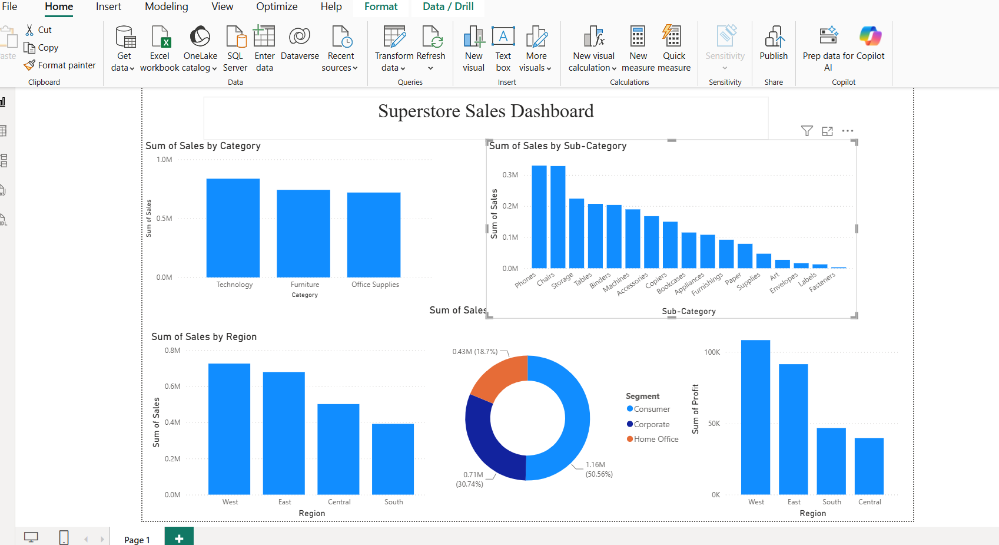

# 📊 Superstore Sales Dashboard

## 📌 Project Overview

This project focuses on analyzing Superstore sales data using **Python (Pandas)** for data analysis and **Power BI** for interactive dashboard creation. The objective is to identify key business insights, sales trends, customer segments, and regional performance to support data-driven decision-making.

---

## 🚀 Tech Stack

* 🐍 Python
* 📊 Pandas
* 📈 Power BI
* 📑 Microsoft Excel / CSV

---

## 📂 Dataset

* **Dataset:** Sample Superstore Dataset
* **Format:** CSV
* **Records:** Sales transactions including:

  * Category
  * Sub-Category
  * Region
  * Segment
  * Sales
  * Profit
  * Quantity
  * Discount

---

## 🔍 Project Workflow

### 1. Data Collection

* Imported the Sample Superstore dataset.

### 2. Data Cleaning

* Checked for missing values.
* Verified data types.
* Prepared the dataset for analysis.

### 3. Exploratory Data Analysis (EDA)

Performed analysis using Python to understand:

* Sales distribution
* Profit trends
* Regional performance
* Product category performance

### 4. Dashboard Creation

Built an interactive Power BI dashboard to visualize business insights.

---

## 📈 Dashboard Insights

The dashboard includes:

* 📊 Sales by Category
* 📊 Sales by Sub-Category
* 🌍 Sales by Region
* 👥 Sales by Segment
* 💰 Profit by Region

---

## 📸 Dashboard Preview

> Add your dashboard screenshot here.



---

## 📁 Project Structure

```
Superstore-Sales-Dashboard/
│
├── dataset/
│   └── SampleSuperstore.csv
│
├── python/
│   └── sales_analysis.py
│
├── power bi/
│   └── Superstore_Sales_Dashboard.pbix
│
├── dashboard.png
│
└── README.md
```

---

## 📌 Key Insights

* Technology generated the highest sales among all categories.
* West region achieved the highest sales and profit.
* Consumer segment contributed the largest share of sales.
* Phones and Chairs were among the highest-selling sub-categories.

---

## 🎯 Skills Demonstrated

* Data Cleaning
* Exploratory Data Analysis (EDA)
* Data Visualization
* Dashboard Design
* Business Insight Generation
* Power BI Reporting
* Python (Pandas)

---

## 📬 Author

**Sneha Hampayya Hiremath**

GitHub: *https://github.com/SnehaHiremath-859*
Linkedin: *https://www.linkedin.com/in/sneha-hampayya-hiremath-312922333*
